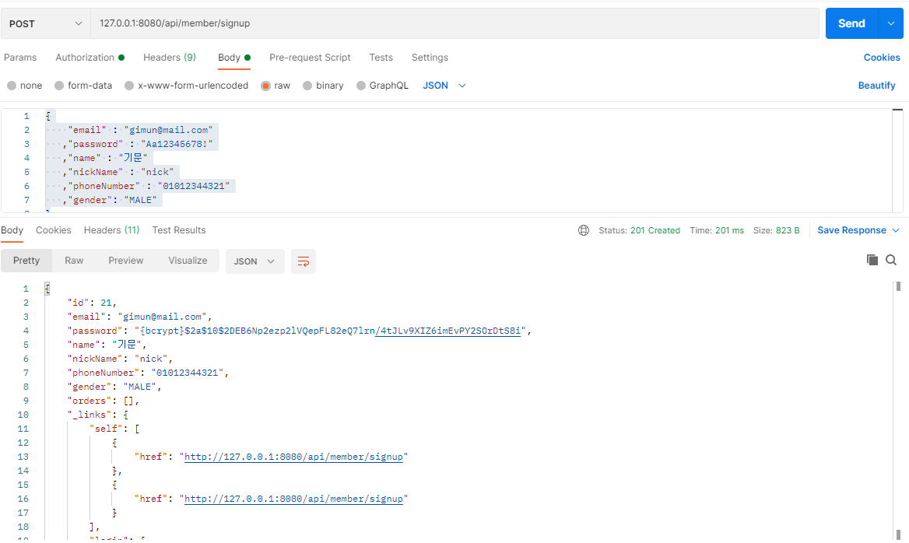
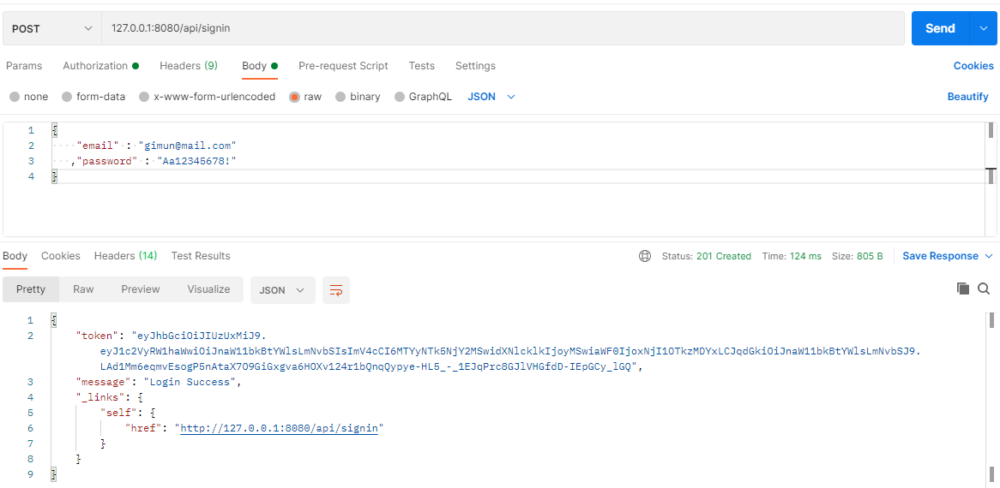
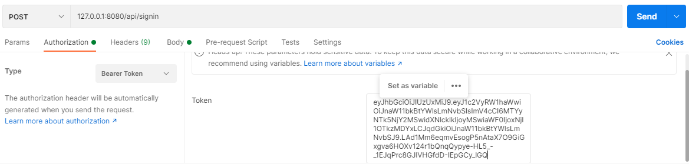
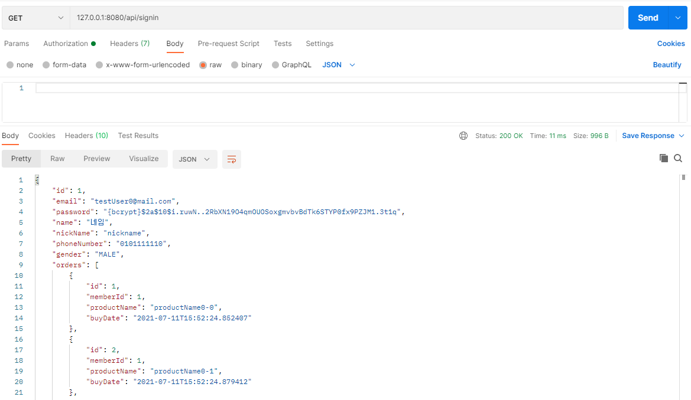
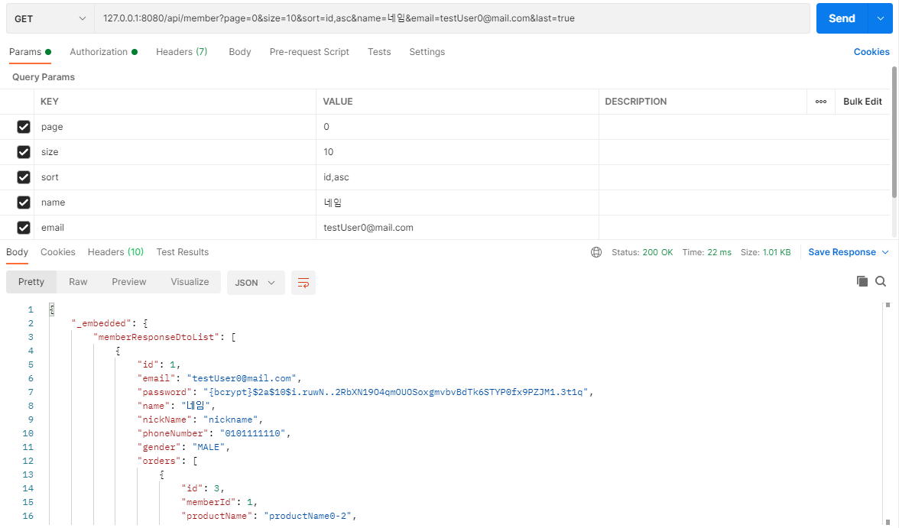
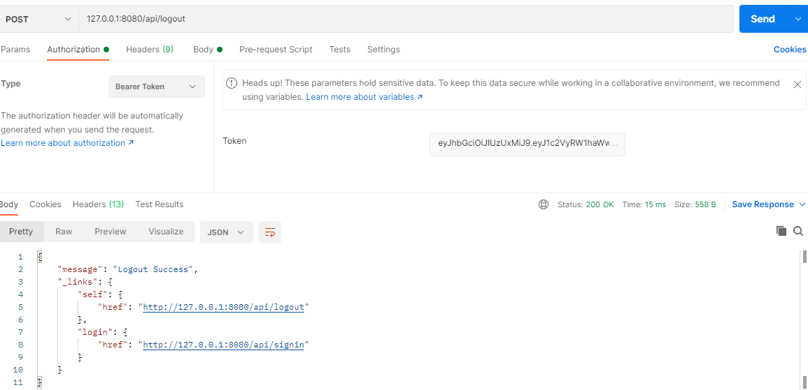

# idusTask
아이디어스 백앤드 과제(JAVA)

### 프로젝트 개발 환경
    - spring boot
    - lombok
    - spring hateoas
    - DB 관련
        - h2
        - spring data jpa
        - querydsl
    - 인증
        - spring secority
        - jsonwebtoken
    - API문서
        - swagger-ui
    - 빌드툴
        - gradle

#### 1. 프로젝트 빌드
    - 프로젝트 셋팅후 querydsl 사용을 위해 빌드 수행
    - gradle > Tasks > other > compileQuerydsl


#### 2. 프로젝트 실행
- IdustaskApplication 에서 서버 run
```java
@EnableJpaAuditing
@SpringBootApplication
public class IdustaskApplication {

    public static void main(String[] args) {
        SpringApplication.run(IdustaskApplication.class, args);
    }
}
```

#### 3. Postman으로 api 테스트
- 회원가입
    - post 127.0.0.1:8080/api/member/signup 로 회원가입
    - request body
    ```json
    {
        "email" : "gimun@mail.com"
       ,"password" : "Aa12345678!"
       ,"name" : "기문"
       ,"nickName" : "nick"
       ,"phoneNumber" : "01012344321"
       ,"gender": "MALE"
    }
    ```    
        


- 로그인      
    - post 127.0.0.1:8080/api/signin 로 인증 토큰 생성
        
    
- 생성된 토큰 설정
    - Authorization > Type > Bearer Token 설정
        

- 로그인한 회원 상세정보 및 주문목록 조회
    - get 127.0.0.1:8080/api/member/myinfo
    - 아래 회원으로 로그인할 경우 미리 생성해둔 주문정보가 있기에 같이 조회할수 있음.
        ```json
            {
                "email" : "testUser0@mail.com"
               ,"password" : "Aa12345678!"
            }
        ```
        
    
- 여러 회원 목록 조회
    - 파라미터
        - page : 페이지
        - size : 사이즈
        - sort : 정렬조건
        - name : 이름
        - email : 이메일
        - last : 마지막주문만 조회할지 여부 (true/false)
    - 회원목록 페이지번호로 10개씩 조회
        - get 127.0.0.1:8080/api/member?page=0&size=10&sort=id,asc&last=true
    - name, email로 회원 검색
        - get 127.0.0.1:8080/api/member?page=0&size=10&sort=id,asc&name=네임&email=testUser0@mail.com&last=true
            

- 로그아웃
    - post 127.0.0.1:8080/api/logout 로 로그아웃
        

- API 문서 조회
    - http://127.0.0.1:8080/swagger-ui/index.html

