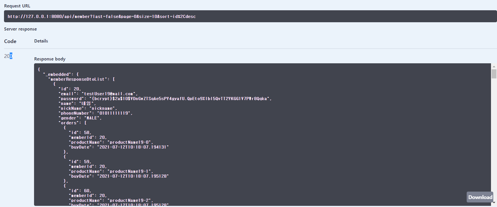

# idusTask
아이디어스 백앤드 과제(JAVA)

### 프로젝트 개발 환경
    - spring boot
    - lombok
    - spring hateoas
    - DB 관련
        - h2
        - spring data jpa
        - querydsl
    - 인증
        - spring security
        - jsonwebtoken
    - API문서
        - swagger-ui
    - 빌드툴
        - gradle

#### 1. 프로젝트 빌드
    - 프로젝트 셋팅후 querydsl 사용을 위해 빌드 수행
    - gradle > Tasks > other > compileQuerydsl


#### 2. 프로젝트 실행
- IdustaskApplication 에서 서버 run
```java
@EnableJpaAuditing
@SpringBootApplication
public class IdustaskApplication {

    public static void main(String[] args) {
        SpringApplication.run(IdustaskApplication.class, args);
    }
}
```

#### 3. Swagger-ui로  Api 테스트
- http://127.0.0.1:8080/swagger-ui/index.html로 접속
- 회원가입
    - member-controller > post /api/member/signup 로 회원가입
        - request
        ```json
        {
            "email" : "gimun@mail.com"
           ,"password" : "Aa12345678!"
           ,"name" : "기문"
           ,"nickName" : "nick"
           ,"phoneNumber" : "01012344321"
           ,"gender": "MALE"
        }
        ```    
            
        - response
            
    

- 로그인      
    - jwt-authentication-controller >  post /api/signin 로 인증 토큰 생성
        - request
            
        - response
            
    
- 생성된 토큰 설정
    - 위에서 생성된 토큰 복사하여 Authorize에 입력
            
            

- 로그인한 회원 상세정보 및 주문목록 조회
    - member-controller > get /api/member/myinfo 로 회원 상세조회
        - request
           
        - response
           
    - 등록된 주문정보가 없기때문에 주문정보는 조회되지 않음.
    - 아래 회원으로 로그인할 경우 미리 생성해둔 주문정보가 있기에 같이 조회할수 있음.
    ```json
        {
            "email" : "testUser0@mail.com"
           ,"password" : "Aa12345678!"
        }
     ```
    
- 여러 회원 목록 조회
    - 파라미터
        - page : 페이지
        - size : 사이즈
        - sort : 정렬조건
        - name : 이름
        - email : 이메일
        - last : 마지막주문만 조회할지 여부 (true/false)
    - member-controller > get /api/member 로 회원 상세조회
    - 회원목록 한페이지에 10명의 회원씩 0번째 페이지 조회 (id로 오름차순 정렬)
        - request
           
        - reponse 
            
    - 이메일과 이름으로 회원 검색 (마지막 주문정보만 조회)
        - request
            
        - reponse 
            

- 주문생성
    - order-info-controller > post /api/order 로 주문생성
        - requestBody
         
        ```json
            {
              "buyDate": "2021-07-12T01:42:26.754Z",
              "productName": "string"
            }
        ```
        - response
         
    - 주문생성후 위에 회원 상세정보를 다시 조회하면 주문정보가 생성된 것을 확인할수 있다.
      
- 로그아웃
    - jwt-authentication-controller >  post /api/logout 로 인증 토큰 만료
        - request
            
        - response
            
        

